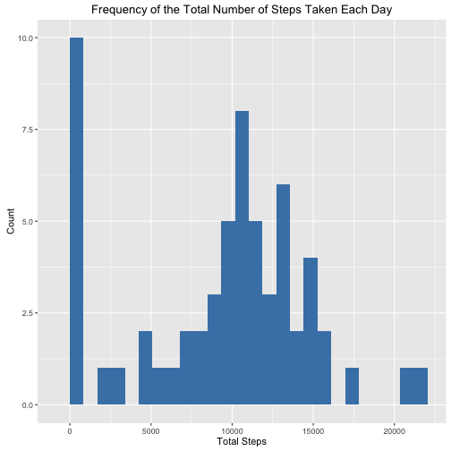
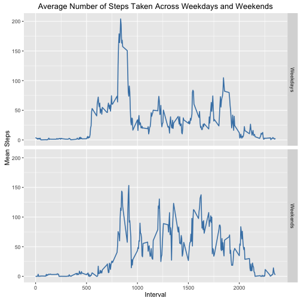

# Reproducible Research: Course Project 1
========================================================
#### date created: "2016-07-09"  

#### Load libraries

```r
library(dplyr)
library(ggplot2)
```

## Loading and preprocessing the data

#### Download and unzip data file if necessary

```r
if(!exists("activity")) {
  url <- "https://d396qusza40orc.cloudfront.net/repdata%2Fdata%2Factivity.zip"
  destinfile <- "./repdata_data_activity.zip"
  download.file(url, destinfile, method="curl")
  unzip(destinfile)
}
```

#### Load data and convert data variable

```r
activity <- read.csv("activity.csv", na.strings="NA")
activity$date <- as.Date(as.character(activity$date), format="%Y-%m-%d")
head(activity)
```

```
##   steps       date interval
## 1    NA 2012-10-01        0
## 2    NA 2012-10-01        5
## 3    NA 2012-10-01       10
## 4    NA 2012-10-01       15
## 5    NA 2012-10-01       20
## 6    NA 2012-10-01       25
```

## What is mean total number of steps taken per day?

#### Calculate the total number of steps taken per day 
(note: missing values were omitted from calculation)

```r
total.steps <- activity %>% group_by(date) %>% summarize(total = sum(steps, na.rm=TRUE))
head(total.steps)
```

```
## Source: local data frame [6 x 2]
## 
##         date total
##       <date> <int>
## 1 2012-10-01     0
## 2 2012-10-02   126
## 3 2012-10-03 11352
## 4 2012-10-04 12116
## 5 2012-10-05 13294
## 6 2012-10-06 15420
```

#### Make a histogram of the total number of steps taken each day

```r
hist.steps <- ggplot(total.steps, aes(total))
hist.steps + geom_histogram(stat="bin", fill="steelblue", bins=25) + 
  ggtitle("Frequency of the Total Number of Steps Taken Each Day") + 
  labs(x="Total Steps", y="Count")
```



#### Calculate the mean and median total number of steps taken per day

```r
mn <- mean(total.steps$total)
med <- median(total.steps$total)
```
The mean and median total number of steps taken per day is 9354.2295082 and 10395 respectively.

## What is the average daily activity pattern?

#### Make a time series plot of the 5-minute interval (x-axis) and the average number of steps taken, averaged across all days (y-axis)

```r
time.series <- ggplot(activity, aes(interval, steps))
time.series + stat_summary(fun.y="mean", geom="line", color="steelblue", lwd=0.75) + 
  ggtitle("Average Number of Steps Taken Across All Days") + 
  labs(x="5-Minute Interval", y="Mean Steps")
```


#### Which 5-minute interval, on average across all the days in the dataset, contains the maximum number of steps?

```r
mean.ordered <- activity %>% group_by(interval) %>% summarize(mean = mean(steps, na.rm=TRUE)) %>% 
  arrange(desc(mean))
maximum <- mean.ordered$interval[1]
```
The 835 minute interval contains the maximum number of steps, averaged across all days.

## Imputing missing values

There are a number of days/intervals where there are missing values (coded as NA). The presence of missing days may introduce bias into some calculations or summaries of the data.

#### Calculate and report the total number of missing values in the dataset

```r
na.sum <- sum(is.na(activity$steps))
```
There are a total number of 2304 rows with NAs in the dataset.

#### Create a new dataset that is equal to the original dataset but with the missing data filled in

Assuming that this individual has a regular schedule and does similar activities at the same time everyday, all of the missing values are filled in with the mean value for that 5-minute interval.


```r
mean.interval <- aggregate(steps~interval, data=activity, mean)
activity.complete <- activity
activity.complete$steps <- ifelse(is.na(activity.complete$steps), 
                                  mean.interval$steps[mean.interval$interval %in% activity.complete$steps], 
                                  activity.complete$steps)
```


#### Make a histogram of the total number of steps taken each day

```r
total.steps.complete <- activity.complete %>% group_by(date) %>% summarize(total=sum(steps, na.rm=TRUE))
hist.steps.complete <- ggplot(total.steps.complete, aes(total))
hist.steps.complete + 
  geom_histogram(stat="bin", fill="steelblue", bins=25) + 
  ggtitle("Frequency of the Total Number of Steps Taken Each Day") + 
  labs(x="Total Steps", y="Count")
```


#### Calculate the mean and median total number of steps taken per day

```r
mn.complete <- mean(total.steps.complete$total)
med.complete <- median(total.steps.complete$total)

mn.diff <- mn.complete - mn
med.diff <- med.complete - med
```
The mean and median total number of steps taken per day is 9754.7126508 and 1.0395 &times; 10<sup>4</sup> respectively. After imputing data for the missing values, the mean is higher (difference of 400.4831426), while the median remains the same (difference of 0).

## Are there differences in activity patterns between weekdays and weekends?

#### Create a new factor variable in the dataset with two levels -- "weekday" and "weekend" 
(note: the imputed dataset was used)

```r
activity.complete$day <- ifelse(weekdays(activity.complete$date)=="Saturday"| 
                                  weekdays(activity.complete$date)=="Sunday", "Weekends", "Weekdays")
```

#### Make a panel plot containing a time series plot of the 5-minute interval (x-axis) and the average number of steps taken, averaged across all weekday days or weekend days (y-axis).

```r
wk.series <- ggplot(activity.complete, aes(interval, steps))
wk.series + stat_summary(fun.y="mean", geom="line", color="steelblue", lwd=0.75) + 
  facet_grid(day ~.) + 
  ggtitle("Average Number of Steps Taken Across Weekdays and Weekends") + 
  labs(x="Interval", y="Mean Steps")
```



